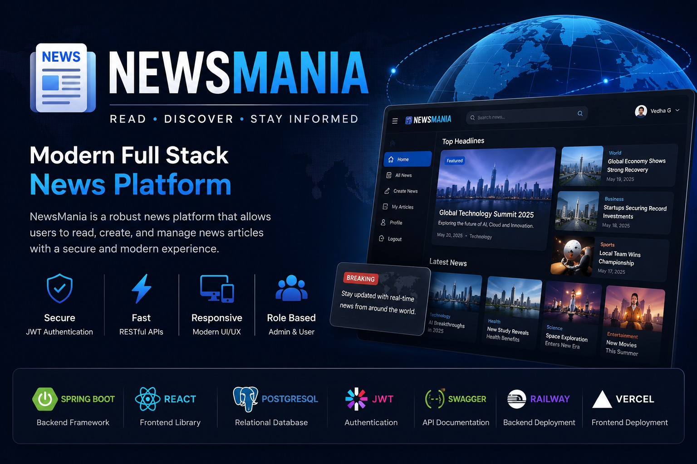
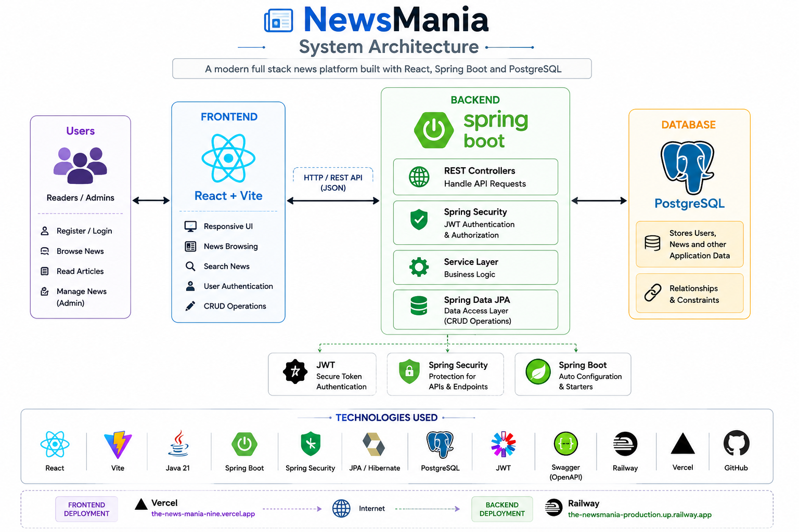
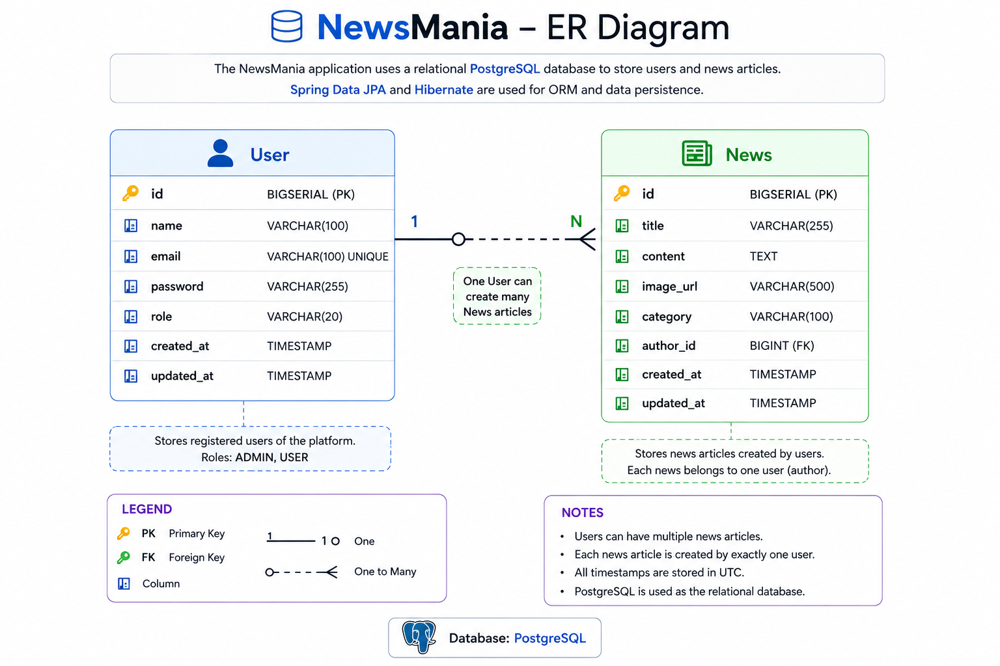
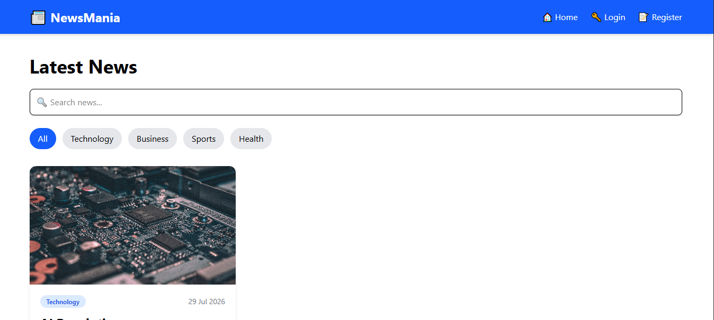
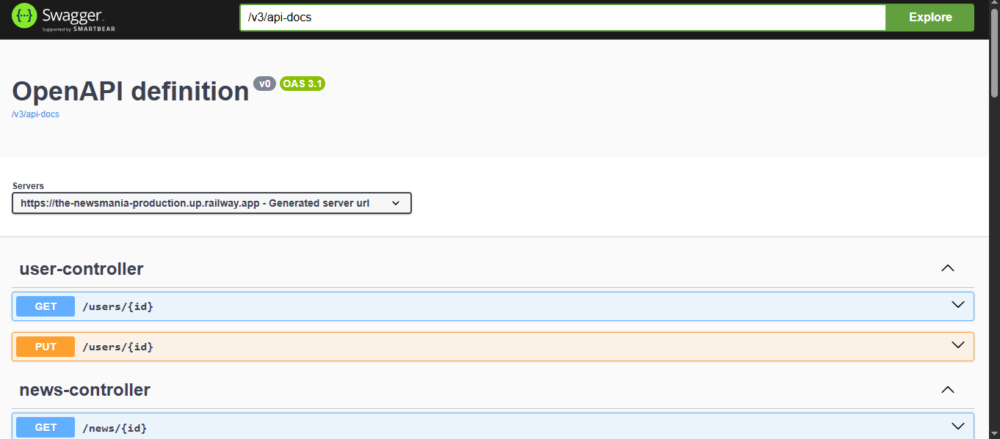

<p align="center">
  
</p>

<h1 align="center">📰 NewsMania</h1>

<h3 align="center">
Modern Full Stack News Platform
</h3>

<p align="center">
A secure, scalable and responsive News Management Platform built using Spring Boot, React, PostgreSQL and JWT Authentication.
</p>

<p align="center">


</p>

---
# 🚀 Overview

**NewsMania** is a modern full-stack news platform that enables users to discover, browse, and manage news articles through a secure and responsive web application.

The application follows a **client-server architecture**, with a **Spring Boot** backend exposing RESTful APIs and a **React** frontend providing an interactive user experience. It uses **JWT-based authentication** to secure protected operations and **PostgreSQL** as the persistent data store.

This project was built to demonstrate practical software engineering concepts such as layered architecture, REST API development, authentication and authorization, database integration, API documentation, cloud deployment, and full-stack application development.

Whether deployed locally or in the cloud, NewsMania is designed with maintainability, scalability, and clean code practices in mind.

---
# 🌐 Live Demo

| Service | Link |
|---------|------|
| 🖥️ Frontend | https://the-news-mania-nine.vercel.app |
| ⚙️ Backend API | https://the-newsmania-production.up.railway.app |
| 📚 Swagger API Documentation | https://the-newsmania-production.up.railway.app/swagger-ui/index.html |

> **Note:** The backend is deployed on Railway's free tier. If the service has been idle, the first request may take a few seconds while it wakes up.

---
# ✨ Features

## 👤 Authentication & Security
- Secure user registration and login
- JWT-based authentication
- Password encryption using Spring Security
- Protected API endpoints
- Role-based authorization support

## 📰 News Management
- Create, update, and delete news articles
- Browse all published news
- View detailed news articles
- Search and manage news efficiently

## 💻 Responsive User Interface
- Clean and responsive React-based interface
- Modern component-based architecture
- User-friendly navigation
- Optimized for desktop and mobile devices

## 🔗 RESTful APIs
- Well-structured REST API design
- JSON request and response handling
- Proper HTTP status codes
- Interactive API documentation using Swagger UI

## 🗄 Database Management
- PostgreSQL database integration
- Efficient data persistence using Spring Data JPA
- Entity relationships managed with Hibernate ORM

## ☁ Deployment
- Backend deployed on Railway
- Frontend deployed on Vercel
- Production-ready REST API
- Cloud-hosted PostgreSQL database

---
# 🛠️ Tech Stack

| Category | Technologies |
|----------|--------------|
| **Frontend** | React, Vite, JavaScript, HTML5, CSS3 |
| **Backend** | Java 21, Spring Boot, Spring MVC, Spring Data JPA |
| **Security** | Spring Security, JWT Authentication, BCrypt Password Encoder |
| **Database** | PostgreSQL, Hibernate ORM |
| **API Documentation** | Swagger / OpenAPI |
| **Build Tool** | Maven |
| **Version Control** | Git, GitHub |
| **Deployment** | Railway (Backend), Vercel (Frontend) |
| **IDE & Tools** | IntelliJ IDEA, VS Code, Postman |

---
# 🏗️ System Architecture

The application follows a layered client-server architecture where the React frontend communicates with the Spring Boot backend through REST APIs. Authentication is handled using JWT, and all persistent data is stored in PostgreSQL using Spring Data JPA and Hibernate.

<p align="center">
  
</p>

# 🗄️ Database Design

The NewsMania application uses a relational PostgreSQL database to manage user accounts and news articles. The backend leverages Spring Data JPA and Hibernate ORM for efficient data persistence and entity mapping.

<p align="center">
  
</p>

---

# 📂 Project Structure

```text
The-NewsMania
│
├── backend
│   ├── src
│   │   ├── main
│   │   │   ├── java
│   │   │   │   └── com.newsmania
│   │   │   │       ├── config
│   │   │   │       ├── controller
│   │   │   │       ├── dto
│   │   │   │       ├── entity
│   │   │   │       ├── repository
│   │   │   │       ├── security
│   │   │   │       ├── service
│   │   │   │       └── NewsmaniaApplication.java
│   │   │   └── resources
│   │   │       └── application.properties
│   │   └── test
│   └── pom.xml
│
├── frontend
│   ├── public
│   ├── src
│   │   ├── assets
│   │   ├── components
│   │   ├── pages
│   │   ├── services
│   │   ├── App.jsx
│   │   └── main.jsx
│   └── package.json
│
├── assets
│   ├── banner.png
│   ├── system-architecture.png
│   └── er-diagram.png
│
└── README.md
```

---
# 📡 API Endpoints

The backend exposes RESTful APIs for authentication and news management. All protected endpoints require a valid JWT token.

## 🔐 Authentication APIs

| Method | Endpoint | Description |
|--------|----------|-------------|
| POST | `/auth/register` | Register a new user |
| POST | `/auth/login` | Authenticate user and generate JWT token |

---

## 📰 News APIs

| Method | Endpoint | Description | Authentication |
|--------|----------|-------------|----------------|
| GET | `/news` | Retrieve all news articles | ❌ No |
| GET | `/news/{id}` | Retrieve a news article by ID | ❌ No |
| POST | `/news` | Create a new news article | ✅ Yes |
| PUT | `/news/{id}` | Update an existing news article | ✅ Yes |
| DELETE | `/news/{id}` | Delete a news article | ✅ Yes |

---

## 📖 API Documentation

Interactive API documentation is available through **Swagger UI**.

🔗 **Swagger UI:**  
https://the-newsmania-production.up.railway.app/swagger-ui/index.html

---

# 📸 Application Screenshots

The following screenshots provide an overview of the NewsMania application interface and the backend API documentation.

## 🏠 Frontend

<p align="center">
  
</p>

<p align="center">
  <i>Responsive React-based user interface for browsing and searching news articles.</i>
</p>

---

## 📖 Swagger API Documentation

<p align="center">
  
</p>

<p align="center">
  <i>Interactive OpenAPI documentation for testing and exploring REST endpoints.</i>
</p>

---

# ⚙️ Installation & Setup

Follow these steps to run the project locally.

## 1️⃣ Clone the Repository

```bash
git clone https://github.com/vedhajanardhan/The-NewsMania.git
cd The-NewsMania
```

---

## 2️⃣ Backend Setup (Spring Boot)

```bash
cd backend
```

### Configure PostgreSQL

Update the `application.properties` file:

```properties
spring.datasource.url=jdbc:postgresql://localhost:5432/newsmania
spring.datasource.username=YOUR_USERNAME
spring.datasource.password=YOUR_PASSWORD
```

### Run the Backend

```bash
./mvnw spring-boot:run
```

or

```bash
mvn spring-boot:run
```

The backend will start at:

```
http://localhost:8080
```

---

## 3️⃣ Frontend Setup (React + Vite)

```bash
cd frontend
npm install
npm run dev
```

The frontend will be available at:

```
http://localhost:5173
```

---

## 4️⃣ API Documentation

Once the backend is running, Swagger UI can be accessed at:

```
http://localhost:8080/swagger-ui/index.html
```

---

# 🚀 Deployment

The application is deployed using modern cloud platforms to ensure accessibility and scalability.

| Component | Platform |
|-----------|----------|
| Frontend | Vercel |
| Backend | Railway |
| Database | Neon PostgreSQL |
| API Documentation | Swagger / OpenAPI |

### Deployment Architecture

- **Frontend** is deployed on **Vercel**
- **Backend REST API** is deployed on **Railway**
- **PostgreSQL database** is hosted on **Neon**
- **Swagger UI** is available for API testing and documentation

---

# 🔮 Future Enhancements

The following enhancements are planned to further improve the application:

- ⭐ Bookmark and save favorite news articles
- 🔍 Advanced search and filtering
- 🌙 Dark mode support
- 💬 Comments and user interactions
- 📊 Admin dashboard with analytics
- 🔔 Email notifications for breaking news
- 📱 Progressive Web App (PWA) support
- ☁️ Docker containerization for simplified deployment
- 🧪 Unit and integration test coverage using JUnit and Mockito

---

# 👩‍💻 Author

**Vedh Janardhan**

- 🎓 Information Science Engineering Student
- 💻 Aspiring Software Development Engineer (Backend / Full Stack)
- 🌱 Passionate about Java, Spring Boot, React, REST APIs, and Backend Development

### 📬 Connect with Me

- **GitHub:** https://github.com/vedhajanardhan
- **LinkedIn:** www.linkedin.com/in/vedhajanardhan123

---

⭐ If you found this project useful, consider giving it a star!
                        
        
